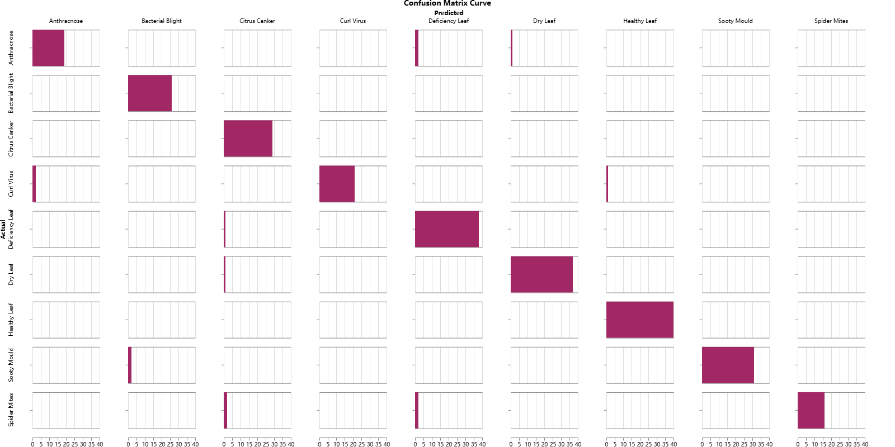
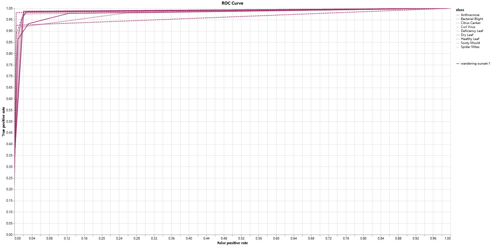
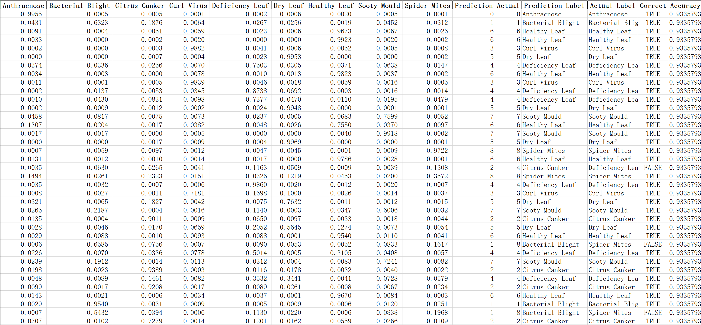
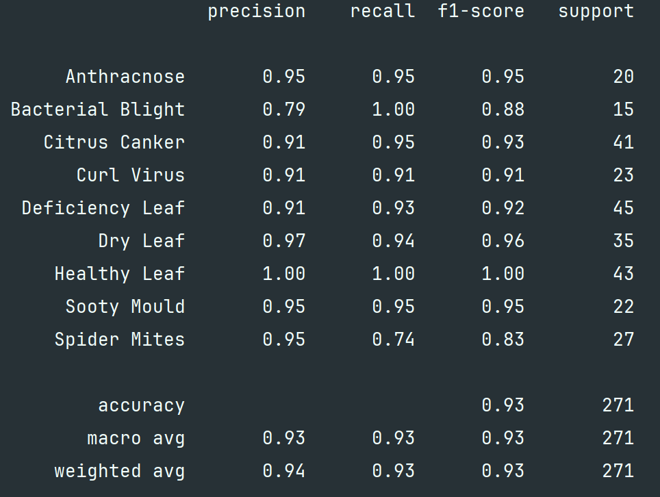
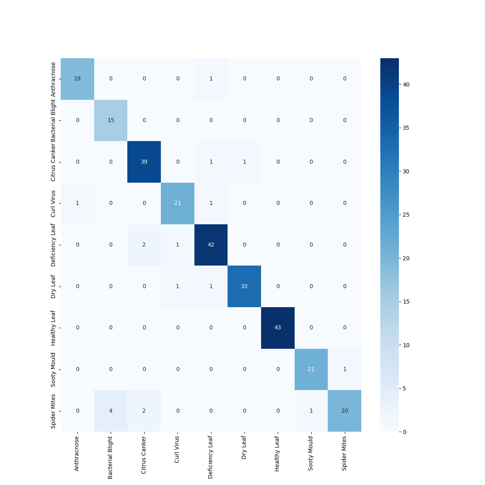
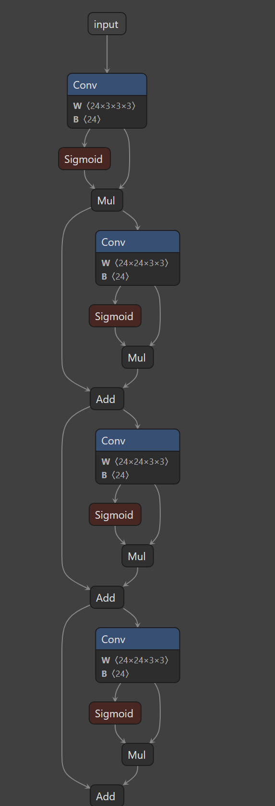

# 项目介绍

## 项目名称

基于`EfficientNetV2.M`卷积神经网络实现柠檬叶疾病（`Lemon Leaf Disease`）区分

## 项目描述

本项目旨在利用深度学习中的卷积神经网络（CNN）技术，构建一个高效、精准的柠檬叶片疾病自动识别系统。针对农业生产中柠檬叶片病害（如疮痂病、黄斑病、炭疽病等）人工诊断效率低、误判率高等痛点，通过计算机视觉技术实现病害的快速分类。

[TOC]


# 数据集

## 数据集介绍

柠檬叶病数据集（`LLDD`）是一个高质量的图像数据集，旨在用于训练和评估柠檬叶病分类的机器学习模型。该数据集包含健康和患病柠檬叶的图像，使其适用于植物疾病检测、图像分类以及农业中的深度学习应用。

## 数据集来源

数据集来源于:https://www.kaggle.com/datasets/mahmoudshaheen1134/lemon-leaf-disease-dataset-lldd/data

## 数据增强

使用数据增强来扩展数据集，提升模型的泛化能力。

```python
import torchvision.transforms.v2 as v2
import torch

transform = v2.Compose([
    # 调整大小
    v2.Resize(size=(480, 480)),
    # 几何变换
    v2.RandomHorizontalFlip(p=0.5),
    v2.RandomVerticalFlip(p=0.5),
    v2.RandomRotation(degrees=(-30, 30)),
    v2.CenterCrop(size=(480, 480)),
    # 颜色变换
    v2.ColorJitter(brightness=0.5, contrast=0.5, saturation=0.5, hue=0.5),
    v2.RandomGrayscale(p=0.2),
    # 转换为张量
    v2.PILToTensor(),
    v2.ToDtype(torch.float32),
    # 归一化
    v2.Normalize(mean=[0.485, 0.456, 0.406], std=[0.229, 0.224, 0.225])
])
```

## 数据分割

将数据集分割为**训练集**、**验证集**以及**测试集**，按照`6:2:2`的比例划分。

```python
from sklearn.model_selection import train_test_split


# 数据集划分
train_val_data, test_data, train_val_labels, test_labels = train_test_split(data, label, test_size=0.2,
                                                                            random_state=42)
train_data, val_data, train_labels, val_labels = train_test_split(train_val_data, train_val_labels,
                                                                  test_size=0.25, random_state=42)
```

# 神经网络

- **模型类型**：`EfficientNetV2.M`
- **修改部分**：
  - 将最后分类层的输出调整为9，并进行迁移训练。

```python
import torch
import torch.nn as nn
from torchvision.models.efficientnet import efficientnet_v2_m


class LemonLeavesDiseasesModel(nn.Module):
    def __init__(self, num_classes: int, weights=None):
        super().__init__()
        # 加载预训练权重
        self.model = efficientnet_v2_m(weights=weights)

        # 冻结特征提取层
        for param in self.model.parameters():
            param.requires_grad = False

        # 替换分类器
        self.model.classifier = nn.Sequential(
            nn.Dropout(0.3, inplace=True),
            nn.Linear(1280, num_classes)
        )

        # 初始化分类器权重
        self._init_classifier_weights()

    def _init_classifier_weights(self):
        for module in self.model.classifier:
            if isinstance(module, nn.Linear):
                torch.nn.init.xavier_uniform_(module.weight)
                if module.bias is not None:
                    module.bias.data.fill_(0.01)

    def forward(self, x) -> torch.Tensor:
        return self.model(x)

    def predict(self, x: torch.Tensor) -> torch.Tensor:
        """
        :param x: 输入的图像，大小480x480。
        :return: 预测的标签
        """
        self.eval()  # 切换到评估模式
        with torch.no_grad():
            output = self.model(x)
            pred = torch.argmax(output, dim=1)
        return pred

    def predict_proba(self, x: torch.Tensor) -> torch.Tensor:
        """
        预测概率
        :param x: 输入的图像，大小480x480。
        :return: 预测的概率
        """
        self.eval()  # 切换到评估模式
        with torch.no_grad():
            output = self.model(x)
            pred = torch.softmax(output, dim=1)
        return pred
```

# 模型训练

## 训练参数

- **核心参数**：
  - **学习率**：`0.001`
  - **训练集批次大小**：`128`
  - **验证集批次大小**：`512`
  - **迭代次数**：`75`

## 损失函数

- **损失函数类型**：`CrossEntropyLoss`

```python
from torch.nn import CrossEntropyLoss

# 定义损失函数
criterion = CrossEntropyLoss()
```

## 优化器

- **优化器类型**：`AdamW`
- **优化的参数**：仅分类层参数。

```python
from torch.optim import AdamW

# 定义优化器
# 定义只需要训练的分类层参数
params = filter(lambda p: p.requires_grad, model.parameters())
optimizer = AdamW(params, lr=learning_rate)
```


## 训练过程可视化

训练中在训练集与验证集上持续监测各项指标。

### 训练集与验证集的损失变化


### 训练集与验证集的准确率变化


### 训练集与验证集的召回率变化


### 训练集与验证集的精确率变化


### 训练集与验证集的F1分数变化


### 验证集的混淆矩阵



### 验证集的ROC曲线



# 模型验证

## 测试结果数据化

### 测试集的预测概率



## 指标报表

### 测试集的性能报表



### 测试集的混淆矩阵



# 模型优化

## 继续训练

从检测到的的损失曲线来看，模型并没有完全收敛，可以进一步训练以提高模型的性能。

```python
if continue_last_model:
    model.load_state_dict(torch.load("../ModelWeights/LastModel-LemonLeaves.pth"))

# 定义损失函数
criterion = CrossEntropyLoss()

# 定义优化器
# 定义只需要训练的分类层参数
params = filter(lambda p: p.requires_grad, model.parameters())
optimizer = AdamW(params, lr=learning_rate)

# 训练模型
model = lemon_leaves_train_model(model, train_loader, val_loader, optimizer, criterion, num_epochs, class_types,
                                 device)
```

## 平衡样本量

数据集中`Bacterial Blight`类型的样本较少可能导致了该类型在测试集上的表现不佳，可以分层抽样来改善样本不均的问题。

```python
# 对label进行分层抽样，确保各部分的样本比例一致
train_val_data, test_data, train_val_labels, test_labels = train_test_split(data, label, test_size=0.2,random_state=42,stratify=label)
train_data, val_data, train_labels, val_labels = train_test_split(train_val_data, train_val_labels,test_size=0.25, random_state=42, stratify=label)
```

# 模型应用

## 使用数据集之外的图片进行预测


## 代码实现

```python
import pandas as pd
import torch
from PIL import Image
from torchvision.transforms import v2

from LemonLeavesDiseaseModel import LemonLeavesDiseasesModel

if __name__ == '__main__':
    image = Image.open("../Data/New Images/炭疽病1.jpg")
    transform = v2.Compose([
        v2.Resize(size=(480, 480)),
        v2.PILToTensor(),
        v2.ToDtype(dtype=torch.float32)
    ])

    model = LemonLeavesDiseasesModel()
    model.load_state_dict(torch.load("../ModelWeights/LastModel-LemonLeaves.pth", map_location=torch.device('cpu')))

    probs = model.predict_proba(transform(image).unsqueeze(0))
    prediction_dataframe = pd.DataFrame(probs, columns=model.classes_types)
    prediction_dataframe["Prediction"] = torch.argmax(probs, dim=1)
    prediction_dataframe["Prediction Label"] = prediction_dataframe["Prediction"].apply(lambda x: model.classes_types[x])

    print(prediction_dataframe)
```

## 结果


预测结果为`Anthracnose`（炭疽病），预测正确。

# 模型移植

## ONNX导出模型

```python
def export_onnx_model():
    model = LemonLeavesDiseasesModel()
    model.load_state_dict(torch.load("../ModelWeights/LastModel-LemonLeaves.pth", map_location=torch.device('cpu')))
    model.eval()

    torch.onnx.export(
        model,
        torch.randn(1, 3, 480, 480),
        "../ModelWeights/LastModel-LemonLeaves.onnx",
        opset_version=11,
        input_names=["input"],
        output_names=["output"],
        dynamic_axes={
            "input": {0: "batch_size"},
            "output": {0: "batch_size"}
        }
    )
```

## 使用ONNX模型进行预测

```python
class ONNXModel():
    def __init__(self, model_path):
        self.classes_types = ["Anthracnose", "Bacterial Blight", "Citrus Canker", "Curl Virus", "Deficiency Leaf",
                              "Dry Leaf", "Healthy Leaf", "Sooty Mould", "Spider Mites"]
        self.sess = ort.InferenceSession("../ModelWeights/LastModel-LemonLeaves.onnx")
        self.transformer = v2.Compose([
            v2.Resize(size=(480, 480)),
            v2.PILToTensor(),
            v2.ToDtype(dtype=torch.float32),
            v2.Normalize(mean=[0.485, 0.456, 0.406], std=[0.229, 0.224, 0.225])
        ])

    def predict(self, image_path):
        image = self.transformer(Image.open(image_path))

        return self.classes_types[self.sess.run(None, {"input": image.unsqueeze(0).numpy()})[0].argmax()]


if __name__ == '__main__':
    model = ONNXModel("../ModelWeights/LastModel-LemonLeaves.onnx")
    print(model.predict("../Data/New Images/炭疽病1.jpg"))
```

推理结果


## ONNX模型结构（部分）



# 项目总结

## 问题以及解决方法

- **训练速度慢**
  - **问题**：模型训练速度慢。
  - **解决方法**：
    - 在`AutoDL`远程服务器上训练模型，使用`4090`加速推理，单轮用时从`256s`降低至`95s`。
    - 增大训练的批次大小`64->128`，验证集直一次性推理。
- **数据集偏小**
  - **问题**：数据集的样本较少，容易导致过拟合。
  - **解决方法**：
    - 使用数据增强：使用数据增强能够有效的增加有效数据量，能够增加模型的泛化能力。
- **数据集样本分布不均**
  - **问题**：数据集中某些类型较少（如`Bacterial Blight`，只有`100`张，而`Healthy leaf`则有`184`张），导致模型不能充分的学习特征，在`Bacterial Blight`类别上的表现较差。
  - **解决方法**：分层抽样，使得每个数据集内的样本数量大致相同。
- **远程服务器上环境依赖问题**
  - **问题**：本地与远程服务器上的环境不同，导致模型训练程序无法运行，手动安装依赖非常麻烦。
  - **解决方法**：
    - 使用`pipreqs`生成`requirements.txt`，在服务器上使用`pip install requirements.txt`快速安装依赖。

## 收获

- **迁移训练的训练技巧**
  - **冻结参数**：冻结分类层以外的参数，可以加速训练，无需从头训练。
  - **进行迁移训练时可以加大学习率**：迁移训练时，学习率可以调整为`0.001`。
- **SSH链接远程服务器**：
  - **远程开发**：链接到远程服务器进行开发，快速训练。
- **WandB实时训练监测**：
  - **使用WandB监测训练**：使用WandB的日志功能记录检测模型在训练中表现。

- **ONNX部署模型**：
  - **ONNX部署模型加快推理**：使用ONNX可以部署模型可以加快模型的推理速度。
  - **ONNX打包进行跨平台移植模型**：ONNX打包模型后可以到不同的环境下进行推理。

​	
